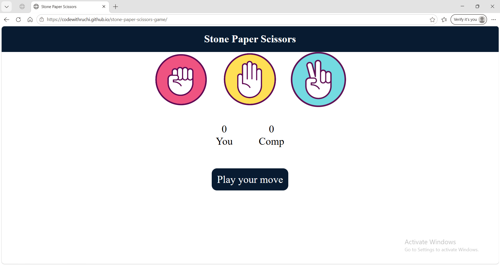

# Live Demo
https://codewithruchi.github.io/stone-paper-scissors-game/

# Stone Paper Scissors Game

## Overview
A simple and interactive Rock Paper Scissors game built using HTML, CSS, and JavaScript.

## Features
- Play against the computer
- Real-time score tracking
- Responsive design
- Interactive user interface

## Technologies Used
- HTML
- CSS
- JavaScript

## What I Learned
- DOM Manipulation
- Event Handling
- JavaScript Logic Building
- Responsive Web Design

## Screenshot

